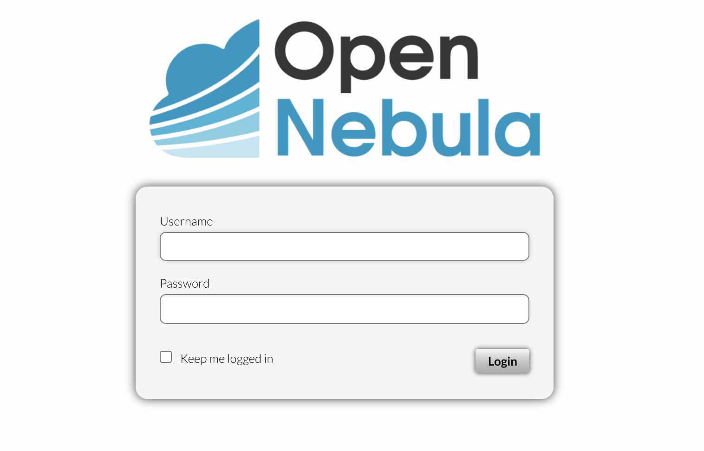
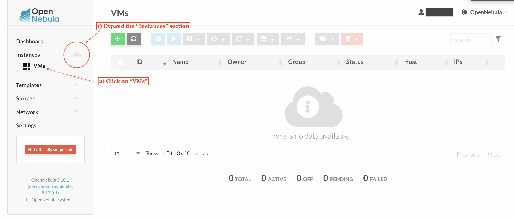
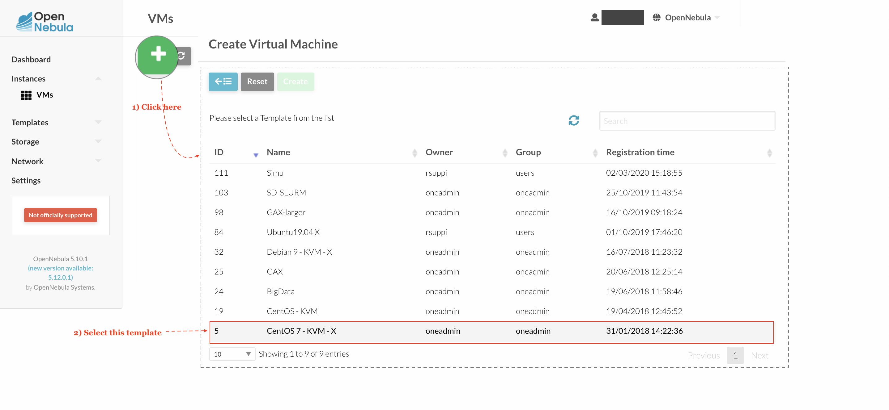
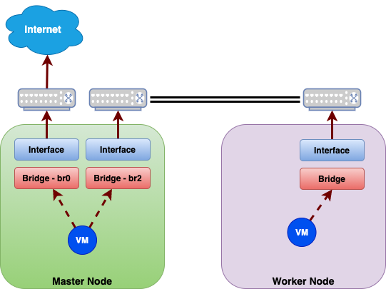

<!-- omit in toc -->
# Lab 01 - OpenNebula Setup

We will learn the basics of [OpenNebula], an open-source management platform to build IaaS (infrastructure as a service) private, public, and hybrid clouds.

Here, we build a private cluster that we will use in the other labs.

Besides the virtual campus's provided material, we intend this guide to offer you more in-depth details regarding the setup process.

|:information_source: The OpenNebula version is `5.10.1` at the time of this writing. In case of doubts, please refer to the [official OpenNebula documentation][OpenNebula Docs].|
|:---|

---

<!-- omit in toc -->
## Table of Contents

- [Login](#login)
- [Virtual Machines Dashboard](#virtual-machines-dashboard)
- [Create a KVM](#create-a-kvm)

---

## Login

We have assigned each group with a user and password combination. You need to point your browser to the OpenNebula's web address and fill the user and password fields:

## Virtual Machines Dashboard

You need to open the Virtual Machine's dashboard to create new virtual machines:

## Create a KVM

We will create a [Kernel-based Virtual Machine][kvm] (KVM) from an already available "CentOS 7 - KVM - X" template:

You will notice the green "Create" button is enable right after selecting the template. You need to provide "Master" as `VM name` and add two network interfaces for it ("Internet" and "Middle").

Please repeat the process for the "Worker" node (:eye: it must have the "Middle" network interface only).

Networking ...

Cluster's nodes need a network connection to interconnect virtual machines or access external resources (e.g., the Internet).

We want to forbid worker nodes to directly access the Internet, but delegate this access to master nodes:

OpenNebula features a concept of [Virtual Network] that we will use in our Master and Worker nodes. We have two Virtual Networks that can be used out of the box: Internet and Middle.

<!-- omit in toc -->
### Internet - Virtual Network

We can use this Virtual Network to allow our Master node to access the Internet. Important attributes:

- `ID`: `0`
- `Bridge`: `br0`
- `DNS`: `158.109.0.1 158.109.0.9`
- `Gateway`: `10.10.10.1`
- `Network Address`: `10.10.10.0`
- `Network Mask`: `255.255.255.0`

<!-- omit in toc -->
### Middle - Virtual Network

This Virtual Network is intended to interconnect virtual machines inside OpenNebula. Important attributes:

- `ID`: `1`
- `Bridge`: `br2`
- `Network Address`: `20.20.20.0`
- `Network Mask`: `2255.255.254.0`

[OpenNebula]: https://opennebula.io/
[OpenNebula Docs]: http://docs.opennebula.io/5.10/operation/index.html
[kvm]: https://www.linux-kvm.org/page/Main_Page
[Virtual Network]: http://docs.opennebula.io/5.10/operation/network_management/manage_vnets.html
